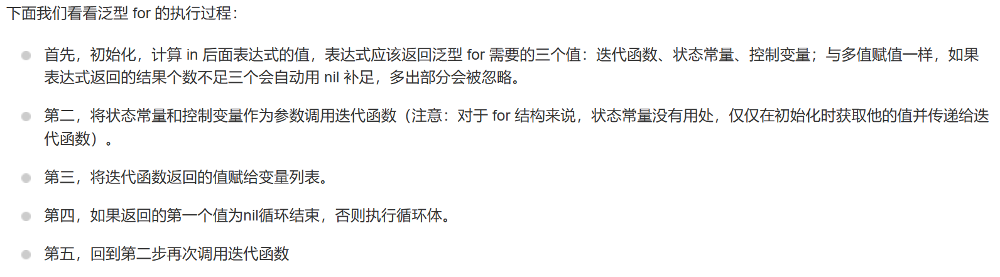
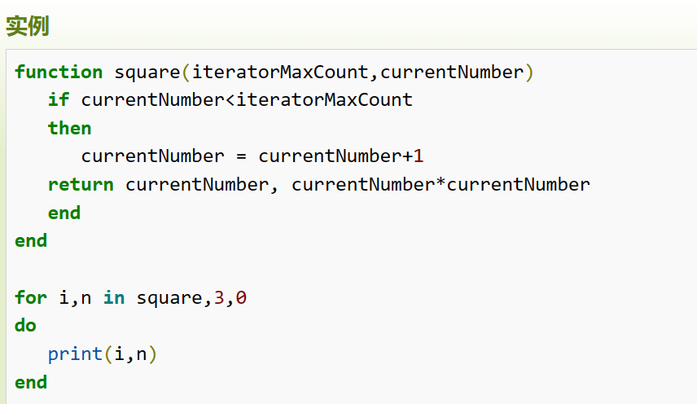
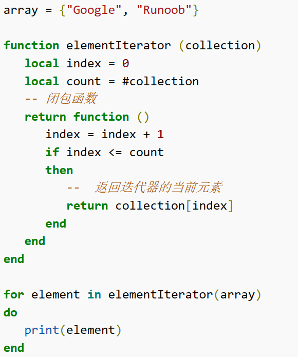
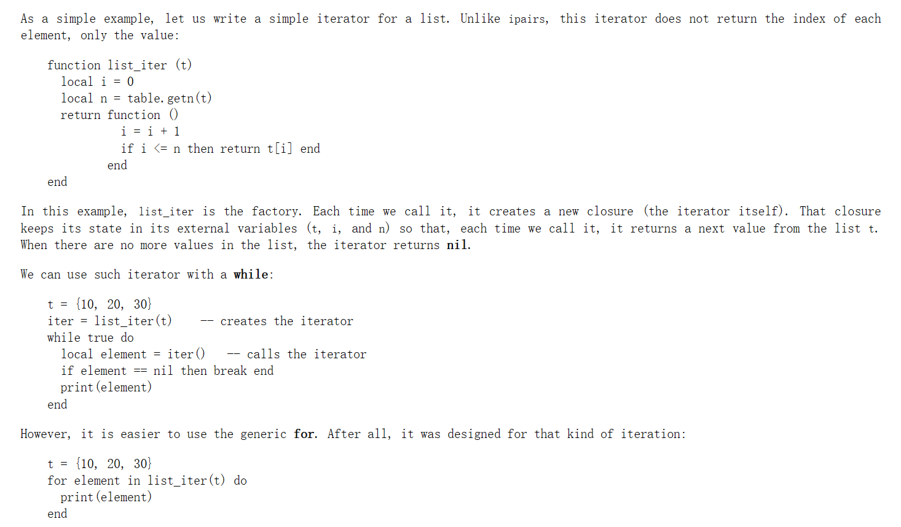
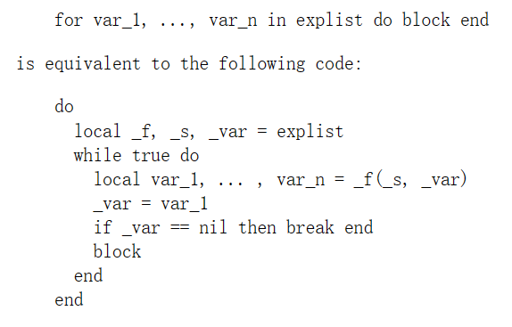

# Basic-Grammar

## boolean

- 除了nil和false之外都是true

## 变量作用域

- 默认为全局

- 使用local前缀表明变量为局部变量
  
  1. 减少变量命名负担。尽量使用局部变量，防止命名冲突。
  
  2. 对局部变量的访问速度更快。

## 循环

- 使用break跳出最内层循环

- 使用goto语句代替continue

## 运算符

- ^ 为幂运算符 `a = 2^3`

- 不等于号为`~=`

## 数组

- 一维数组索引从1开始

- 指定的索引没有值则访问为nil

- 还可以指定负数为索引，此时为可以理解为类型转换

## for

for 在自己内部保存迭代函数，实际上它保存三个值：迭代函数、状态常量、控制变量。

```lua
for var_1, ..., var_n in explist
do
    block
end
```





square为迭代器；3为状态常量，只作初始化用；0位状态变量。状态常量和状态变量作为迭代函数square的参数。

- 使用闭包实现输出集合大小和集合元素
  
  将状态常量和状态变量存在迭代函数中。
  
  
  
  elementIterator(array)返回了一个迭代器（匿名函数，也是闭包函数）for相当于循环调用它返回的函数，也就是可以用作迭代器的匿名函数，并且会判断匿名函数返回的值是否是nil，不是nil就执行block，nil则终止循环，后面继续调用匿名函数（迭代函数/闭包函数）。
  
  上面的例程：执行elementIterator(array)，返回了闭包函数，返回collection[index]，不是nil就赋值给element，然后do block，然后循环调用闭包函数直到返回nil结束for。
  
  
  
  
  
  _f就是返回的匿名函数，调用它可以用于迭代，里面修改条件变量。
