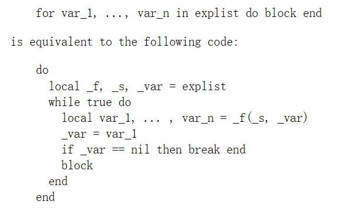

# Basic-Grammar

## boolean

- 除了nil和false之外都是true

## 变量作用域

- 默认为全局

- 使用local前缀表明变量为局部变量
  
  1. 减少变量命名负担。尽量使用局部变量，防止命名冲突。
  
  2. 对局部变量的访问速度更快。

## 循环

- 使用break跳出最内层循环

- 使用goto语句代替continue

## 运算符

- ^ 为幂运算符 `a = 2^3`

- 不等于号为`~=`

## 数组

- 一维数组索引从1开始

- 指定的索引没有值则访问为nil

- 还可以指定负数为索引，此时为可以理解为类型转换

## for

for 在自己内部保存迭代函数，实际上它保存三个值：迭代函数、状态常量、控制变量。

```lua
for var_1, ..., var_n in explist
do
    block
end
```


square为迭代器；3为状态常量，只作初始化用；0位状态变量。状态常量和状态变量作为迭代函数square的参数。

- 使用闭包实现输出集合大小和集合元素
  
  将状态常量和状态变量存在迭代函数中。
  
  
  
  elementIterator(array)返回了一个迭代器（匿名函数，也是闭包函数）for相当于循环调用它返回的函数，也就是可以用作迭代器的匿名函数，并且会判断匿名函数返回的值是否是nil，不是nil就执行block，nil则终止循环，后面继续调用匿名函数（迭代函数/闭包函数）。
  
  上面的例程：执行elementIterator(array)，返回了闭包函数，返回collection[index]，不是nil就赋值给element，然后do block，然后循环调用闭包函数直到返回nil结束for。
  
  
  
  
  
  _f就是返回的匿名函数，调用它可以用于迭代，里面修改条件变量。

- 自己实现ipairs
  
  ```lua
  --自己实现的ipairs，遇到nil终止
  local function my_ipairs(tab)
      local count = #tab;
      local index = 0;
      return function()
          index = index + 1;
          if index <= count then
              if tab[index] ~= nil then
                  return index, tab[index];
              end
          end
      end
  end
  
  local t = { 1, 2, 3, nil, nil, 6 };
  for k, v in my_ipairs(t) do
  
      print(k, v);
  
  end
  for k, v in ipairs(t) do
  
      print(k, v);
  
  end
  --自己实现的pairs，可以跳过人任意个nil
  local function my_pairs(tab)
  
      local count = #tab;
      local index = 0;
      return function()
          index = index + 1;
          if index <= count then
              if tab[index] ~= nil then
                  return index, tab[index];
              else
                  while not tab[index] do
                      if index <= count then
                          index = index + 1;
                      else
                          break;
                      end
                  end
                  if index <= count then
                      return index, tab[index];
                  end
              end
          end
      end
  
  end
  
  for k, v in my_pairs(t) do
  
      print(k, v);
  
  end
  
  for k, v in pairs(t) do
  
      print(k, v);
  
  end
  
  ```

## Table

### table的基本操作

- table类似map，使用key-value表现，除了nil其他字符串都能作为key

- `table = {id = 1,name = "yong"}`

- 取值使用`table.key`或者`table["key"]`

- 添加一个键值对使用`table.key = value`或者`table["key"] = value`

- 删除键值对使用`table.key = nil`或者`table["key"] = nil`

- 使用hash表进行查找的，key是无序的

- 遍历嵌套table的，而且数据是混乱的,默认会先输出没有key，即下面的table会先输出1和2

- 在lua中，我们认为nil是无效的，所以如果nil在表的最后，就直接扔掉，如果nil后面有其它非niL的元素，不得己必须得带着，所以长度不会被最后面的nil影响

```lua
table = {1,2,{"abc","aaa"},name = "yong",sex = "male"};
for k1, v1 in pairs(table) do
if type(v1) == "table" then
for k2, v2 in pairs(v1) do
    print(k2, v2);
end
else
print(k1, v1);
end
end
```

### 数组类型

- `arry = {1,2,3}` `towdim_arry = {{1,2},{3,4},{5,6}}`二维数组类似于数组

- 下标从1开始

- 使用ipairs无法打印不连续的table的所有元素，不连续后面的不打印，用于遍历数组

- 使用pairs可以打印所有元素，用于遍历table，pairs取出键值对

- table的键也可以自定义。
  
  `table = {id = 1,name = "yong"}`

- 不建议数组类型自定义下标，要自定下标使用hash
  
  example：`table = {1,2,3,"hello",4,5,6}`,虽然说混搭也是允许的，但是得区分好

- 二维数组
  
  ```lua
  --遍历二维数组
  t={
      {11,12,13},
      {21,22,23}
  };
  for row,row_table ipairs(t) do
      for col,ele ipairs(row_table) do
          print(row,col,ele);
      end
  end
  
  --创建二维数组
  t4 = {};
  for i = 1,3 do        
     --这句不能缺，不然会报错： attempt to index a nil value
      t4[i] = {};
      for j = 1,3 do
          t4[i][j] = (i -1)*3 + j;
      end
  end
  
  --遍历二维数组
  for i = 1,3 do
      for j = 1,3 do
          print(t4[i][j]);
      end
  end
  
  --创建二维数组
  ```

- table的一些操作，需要对数组进行操作使用时查看官方的文档
  
  example：一个table拼接为字符串`table.concat(list,sep,i,j)`

## string常用api

- 转大小写`string.upper()`和`string.lower()`

- 字符串长度：`string.len()`

- 字符串反转：`string.reverse()`

- 字符串拼接：使用..进行拼接`print("abc".."xyz"..str1,,str2..123 ..456)`
  
  > 如果是数字去拼接其他字符串，需要在数字后面加上一个空格

- 字符串截取子串：`string.sub(str,start,end)`
  
  负号指从右往左数`string.sub(str,-1,-3)`

- 查找子串：
  
  ```lua
  --init指查找的开始位置，负数表示从右往左第几个开始
  --找到返回开始和结束的位置，没找到返回nil
  --[[plain参数为Boolean类型，默认为false，表示开启正则匹配，
  设为true把pattern直接当纯字符串来匹配]]--
  string.find(str,pattern_str,init,plain)
  ```
  
  - 正则表达式

- 字符串替换：
  
  ```lua
  --全部替换，返回替换结果和进行替换的次数,time指定最多替换的次数
  string.gsub(str,pattern_str,replace_str,time) 
  ```

- asscii与字符的转换
  
  ```lua
  --ascii转字符
  string.char(ascii_number)
  ---字符转ASCII,默认只转一个
  string.byte(str,start,end)
  ```
