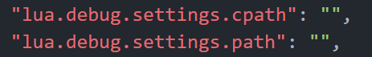

# environment

推荐方案二，方便进行版本管理和源码位置查找

## 方案一

- apt快速安装
  
  ```bash
  sudo apt install lua5.3
  ```

## 方案二

- 官网下载源码：[Lua: download area](https://www.lua.org/ftp/)进行安装，使用下面的命令

```bash
#不同版本只需修改lua-5.3.0.tar.gz
$ wget http://www.lua.org/ftp/lua-5.3.0.tar.gz
$ tar zxf lua-5.3.0.tar.gz
$ cd lua-5.3.0
$ vi Makefile
# 此变量为安装的路径 自行设置位置，INSTALL_TOP= /usr/local/lua5.3
$ make linux
$ make install
#如果查找不到lua，需要将可执行文件的目录添加到环境变量中
```

## LuaRocks 安装

参考：[LuaRocks - The Lua package manager](https://luarocks.org/)

```bash
$ wget https://luarocks.org/releases/luarocks-3.9.2.tar.gz
$ tar zxpf luarocks-3.9.2.tar.gz
$ cd luarocks-3.9.2
#lua的位置根据上面lua安装的目录INSTALL_TOP指定的一致
$  ./configure  --prefix=/usr/local/luarocks\ 
                --with-lua=/usr/local/lua5.3         \
                --with-lua-include=/usr/local/lua5.3/include

$ sudo luarocks install luasocket
$ lua
> require "socket"
```

## VScode调试

- 安装Lua Debug插件

- 添加查找源文件的路径，即`package.path`
  
  
