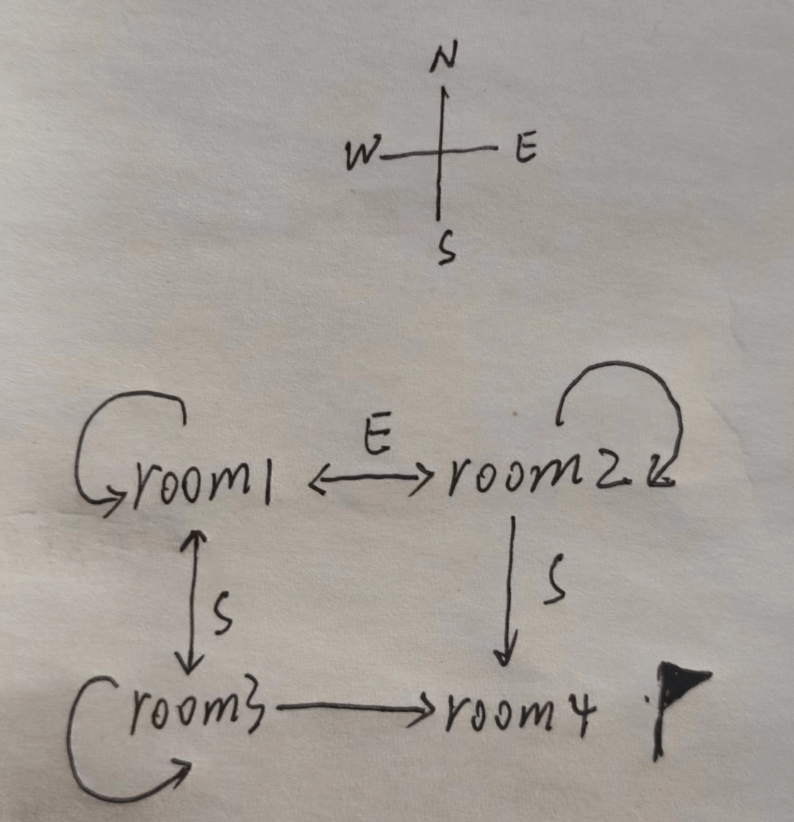

# function

```lua
x,y = foo2(), 20      -- x='a', y=20
```

当 function 不是最后一个时, 如`foo2()`, 它只会返回 return 的第一个值

`(foo2())`: 填上一个括号会强制返回一个值

## Closures

Technically speaking, what is a value in Lua is the closure, not the function. The function itself is just a prototype for closures.

> 相当于`类的私有变量`的概念, 可以用来构造类, prototype 设计

## local

```lua
local fact = function (n)
    if n == 0 then return 1
    else return n*fact(n-1)   -- buggy
    end
end
```

`fact`要等函数表达式构建完才存在, 而内部需要, 所以会报错

```lua
local fact
fact = function (n)
    if n == 0 then return 1
    else return n*fact(n-1)
    end
end
```

提前声明可以解决这个问题

```lua
local function fact (n)
    if n == 0 then return 1
    else return n*fact(n-1)
    end
end
```

相当于上面的语法

## Tail Calls

A tail call happens when a function calls another as its last action, so it has nothing else to do.

```lua
function f (x)
    return g(x)
end
```

可以避免多次使用`stack`, 只用将 f 的参数和 g 的返回值构成`stack`即可

---

A subtle point when we use proper tail calls is what is a tail call.

As such, a quite useful application of proper tail calls in Lua is for programming state machines. Such applications can represent each state by a function; to change state is to go to (or to call) a specific function.

```lua
function room1 ()
    local move = io.read()
    if move == "south" then return room3()
    elseif move == "east" then return room2()
    else print("invalid move")
        return room1-- stay in the same room
    end
end

function room2 ()
    local move = io.read()
    if move == "south" then return room4()
    elseif move == "west" then return room1()
    else print("invalid move")
        return room2()
    end
end

function room3 ()
    local move = io.read()
    if move == "north" then return room1()
    elseif move == "east" then return room4()
    else print("invalid move")
        return room3()
    end
end

function room4 ()
    print("congratulations!")
end
```



## 可变参数

```lua
function average(...)
   result = 0
   local arg={...}
   for i,v in ipairs(arg) do
      result = result + v
   end
   print("总共传入 " .. #arg .. " 个数")
   return result/#arg
end
```

Lua 将函数的参数放在 `arg` 的表中，`#arg` 表示传入参数的个数。
