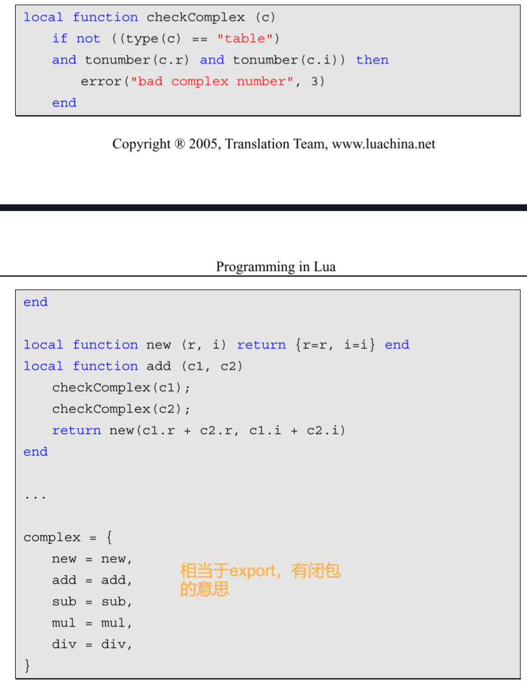
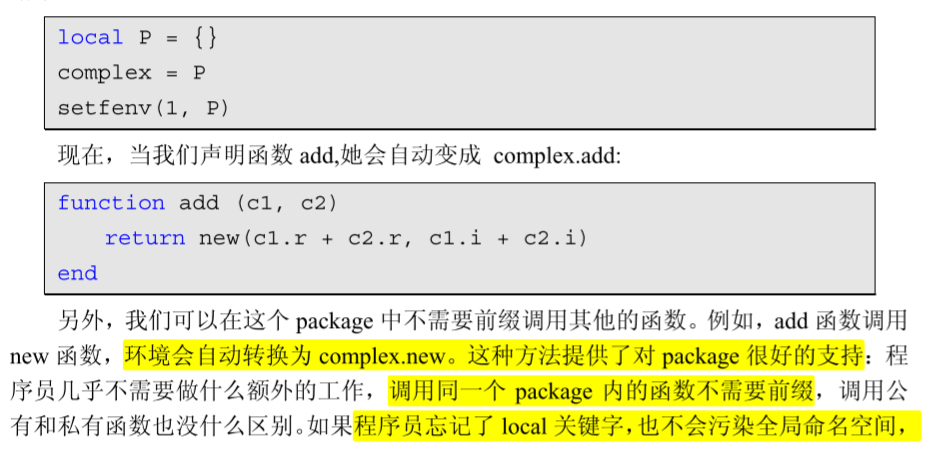
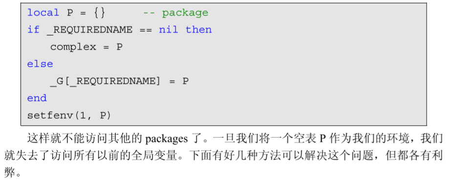
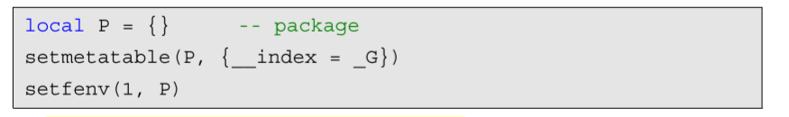
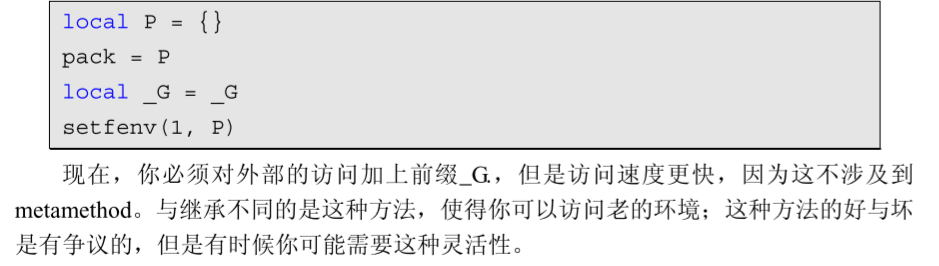
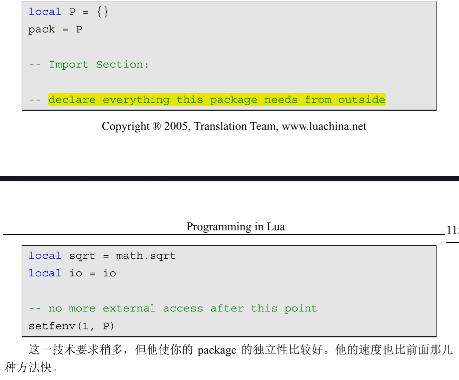

# module

## export

```lua
-- 文件名为 module.lua
-- 定义一个名为 module 的模块
module = {}

-- 定义一个常量
module.constant = "这是一个常量"

-- 定义一个函数
function module.func1()
    io.write("这是一个公有函数！\n")
end

local function func2()
    print("这是一个私有函数！")
end

function module.func3()
    func2()
end

return module
```

## import

```lua
-- test_module.lua 文件
-- module 模块为上文提到到 module.lua
require("module")

print(module.constant)

module.func3()
```

---

alias

```lua
-- test_module2.lua 文件
-- module 模块为上文提到到 module.lua
-- 别名变量 m
local m = require("module")

print(m.constant)

m.func3()
```

## 加载机制

1. Lua 文件: 读取环境变量`LUA_PATH`, 存放在全局变量 package.path 中
   
   ```bash
   #LUA_PATH
   export LUA_PATH="~/lua/?.lua;;"
   ```
   
   文件路径以 ";" 号分隔，最后的 2 个 ";;" 表示新加的路径后面加上原来的默认路径
   
   !> 记得 source 生效
   
   调用 require("module") 时就会尝试打开这些文件目录去搜索目标
   
   调用 package.loadfile 来加载模块

2. C 程序库: 环境变量 `LUA_CPATH` -> 全局变量 `package.cpath`
   
   搜索的是 so 或 dll 类型的文件
   
   通过 package.loadlib 来加载它

## C package

C 包在使用以前必须首先加载并连接，在大多数系统中最容易的实现方式是通过动态连接库机制

Lua 在一个叫 loadlib 的函数内提供了所有的动态连接的功能

```lua
local path = "/usr/local/lua/lib/libluasocket.so"
-- 或者 path = "C:\\windows\\luasocket.dll"，这是 Window 平台下
local f = assert(loadlib(path, "luaopen_socket"))
f()  -- 真正打开库
```

期望二进制的发布库包含一个与前面代码段相似的 stub 文件，安装二进制库的时候可以随便放在某个目录，只需要修改 stub 文件对应二进制库的实际路径即可

将 stub 文件所在的目录加入到 LUA_PATH，这样设定后就可以使用 require 函数加载 C 库了

## 补充

- require的一般工作流程
  
  require所使用的路径与传统的路径不同，require采用的路径是一连串的模式，其中每项都是一种将模块名转换为文件名的方式。require会用模块名来替换每个“？”，然后根据替换的结果来检查是否存在这样一个文件，如果不存在，就会尝试下一项。路径中的每一项都是以分号隔开，比如路径为以下字符串：
  
  ```lua
  ?;?.lua;c:\windows\?;/usr/local/lua/?/?.lua
  ```
  
    那么，当我们require “mod”时，就会尝试着打开以下文件：
  
  ```lua
  mod
  mod.lua
  c:\windows\mod
  /usr/local/lua/mod/mod.lua
  ```
  
  > tip:如果require无法找到与模块名相符的Lua文件，那Lua就会开始找C程序库；
  
  当找到了这个文件以后，如果这个文件是一个Lua文件，它就通过loadfile来加载该文件；如果找到的是一个C程序库，就通过loadlib来加载。loadfile和loadlib都只是加载了代码，并没有运行它们，为了运行代码，require会以模块名作为参数来调用这些代码。

## Package的使用技巧

- 使用固定的局部变量名来代替全局变量，避免在包内重复使用冗长的包名。

- 在函数或者变量前加上 local 使之变为私有，也就是只有 package 本身才能访问

- 问题：
  
  1. 访问同一个 package 内的其他公有的实体写法冗余，必须加上前缀 `Package.`
  
  2. 当我们 修改函数的状态(公有变成私有或者私有变成公有)我们必须修改函数得调用方式
  
  解决方案：可以将 package 内的所有函数都 声明为局部的，最后将他们放在最终的表中。
  
  

- 包与文件
  
  - require 命令使用文件而不是 packages，所以可以使用不同文件名的相同包名的package
  
  - 重命名
    
    **TODO**
  
  - 使用全局表
    
    - 改变了 package 主 chunk 的环境，那么由 package 创建的所有函数 都共享这个新的环境。
    
    - 一旦 package 有一个独占的环境，不仅所有她的函数共享环境， 而且它的所有全局变量也共享这个环境。所以，我们可以将所有的公有函数声明为全局 变量，然后他们会自动作为独立的表（表指 package 的名字）存在，所有 package 必须
      要做的是将这个表注册为 package 的名字。
      
      
    
    - 可以将这种技术和前一节我们使用 的 package 名的方法组合起来：
      
      
      
      1. 使用继承：
         
         
      
      2. 声明一个局部变量来保存老的环境
         
         
      
      3. 把你需要的函数或者 packages 声明为 local：
         
         

## 包管理

- 寻找包时是通过文件名进行寻找的

- 为了避免同名时覆盖，避免在包中使用全局方法，或者说不进行返回

- 在包中将table声明为local，最后将table进行return，可以进行多个table返回，封装在一个table中即可，return两个table只能接受第一个table，第二个参数会变成模块的文件路径，example如下：
  
  ```lua
  -- 文件名为 mypackage.lua
  -- 定义一个名为 module 的模块
  local mypackage = {};
  local test = {name = "test"};
  -- 定义一个常量
  mypackage.constant = "这是一个常量"
  
  -- 定义一个函数
  function mypackage.func1()
      io.write("这是一个公有函数！\n")
  end
  
  local function func2()  --仅供文件内部调用
      print("这是一个私有函数！")
  end
  
  function mypackage.func3()
      func2()
  end
  
  return mypackage,test;
  
  --使用mypackage.lua
  local m,t = require("mypackage");
  --table: 0x55e4cfb58500 /home/yong/ws/example_lua/mypackage.lua
  print(m,t); 
  m.func1();
  m.func3();
  ```

- 使用require ("package_path");时使用一个局部变量进行接收
  
  `local module = require("package_path")`,使用`module.func()`对模块进行使用可以避免与本文件重名的覆盖问题
  
  > 包路径正确但不一定能使用，需要package.path中有这个路径，二者同时满足才可以
  
  `print(package.path);``print(package.cpath);`找lua源文件和so库
  
  `package.path=package.path..";/tmp/?.Lua";`将/tmp/?.lua添加到包寻找路径下

- 当需要多文件管理时，可以使用package.path查看包寻找路径

- 不能互相require，会导致无限展开，死循环，Stack Overflow
